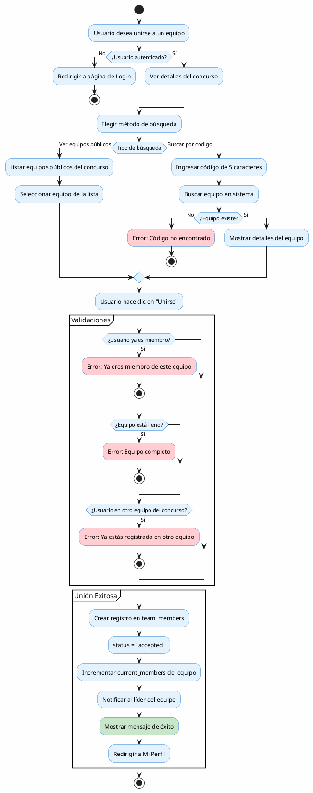
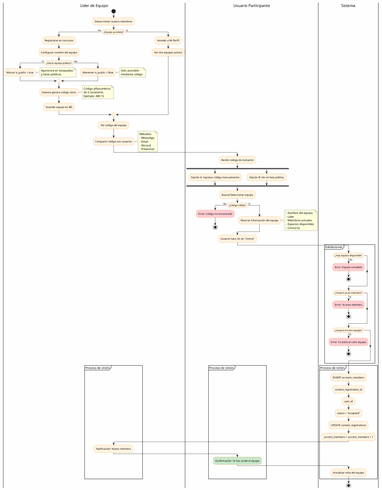
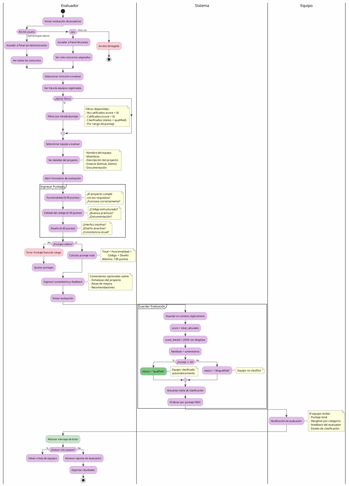

# 📊 Diagramas de Procesos - Sistema CodeBattle

Este documento contiene los diagramas de procesos en formato **PlantUML** para los principales flujos del sistema de gestión de concursos de programación CodeBattle.

> **Nota**: Estos diagramas pueden ser visualizados en [PlantText](https://www.planttext.com/), [PlantUML Online Editor](http://www.plantuml.com/plantuml/), o cualquier visor compatible con PlantUML.

## 📑 Índice
1. [Solicitud para unirse a un equipo](#1-solicitud-para-unirse-a-un-equipo)
2. [Invitación de líderes para integrar nuevos miembros](#2-invitación-de-líderes-para-integrar-nuevos-miembros)
3. [Evaluación de proyectos](#3-evaluación-de-proyectos)
4. [Generación de constancias](#4-generación-de-constancias)

---

## 1. Solicitud para unirse a un equipo

### Descripción
Este proceso permite a un usuario participante buscar y unirse a equipos públicos que tienen cupos disponibles en un concurso específico.

### Actores
- **Usuario Participante**: Usuario con rol "user" que desea unirse a un equipo
- **Sistema**: Plataforma CodeBattle
- **Líder de Equipo**: Usuario que creó el equipo

### Diagrama PlantUML



### Reglas de Negocio

1. **Autenticación obligatoria**: Usuario debe estar logueado
2. **Un equipo por concurso**: Un usuario solo puede pertenecer a un equipo por concurso
3. **Capacidad limitada**: `current_members < max_members`
4. **Equipos públicos**: Solo búsqueda de equipos con `is_public = true`
5. **Estado automático**: Al unirse el estado es `accepted` automáticamente
6. **Código único**: Cada equipo tiene código alfanumérico de 5 caracteres

### Tablas Involucradas
- `users` - Información del usuario
- `contests` - Concursos disponibles
- `contest_registrations` - Equipos registrados
- `team_members` - Miembros de equipos

### Endpoints
```
GET  /concursos/{contest}/equipos-publicos
POST /equipos/buscar
POST /equipos/{team}/unirse
```

---

## 2. Invitación de líderes para integrar nuevos miembros

### Descripción
Este proceso permite al líder de un equipo compartir el código del equipo para invitar a nuevos miembros.

### Actores
- **Líder de Equipo**: Usuario creador del equipo
- **Usuario Participante**: Usuario que desea unirse
- **Sistema**: Plataforma CodeBattle

### Diagrama PlantUML



### Flujo de Datos

**Creación del Equipo:**
```
Líder → Sistema: Registrar en concurso
Sistema → BD: INSERT contest_registrations
              (team_code=ABC12, team_leader_id, is_public)
Sistema → Líder: Mostrar código generado
```

**Invitación:**
```
Líder → Usuario: Compartir código (fuera del sistema)
Usuario → Sistema: Buscar código
Sistema → BD: SELECT * FROM contest_registrations 
              WHERE team_code = 'ABC12'
Sistema → Usuario: Mostrar detalles del equipo
```

**Unión:**
```
Usuario → Sistema: Solicitar unirse
Sistema → BD: INSERT INTO team_members 
              (contest_registration_id, user_id, status='accepted')
Sistema → BD: UPDATE contest_registrations 
              SET current_members = current_members + 1
Sistema → Líder: Notificación
Sistema → Usuario: Confirmación
```

### Endpoints
```
POST /concursos/{id}/registrar - Crear equipo
POST /equipos/buscar - Buscar por código
GET  /concursos/{contest}/equipos-publicos - Listar públicos
POST /equipos/{team}/unirse - Unirse al equipo
```

---

## 3. Evaluación de proyectos

### Descripción
Este proceso permite a administradores y jueces evaluar los proyectos presentados por equipos, asignando puntajes en diferentes categorías.

### Actores
- **Administrador**: Rol `admin` o `super_admin`
- **Juez**: Rol `juez` - evalúa concursos asignados
- **Sistema**: Plataforma CodeBattle

### Diagrama PlantUML



### Criterios de Evaluación

| Categoría | Puntos | Descripción |
|-----------|--------|-------------|
| **Funcionalidad** | 0-40 | Cumplimiento de requisitos, funcionamiento correcto |
| **Calidad del Código** | 0-30 | Estructura, buenas prácticas, documentación |
| **Diseño** | 0-30 | UI/UX, estética, consistencia visual |
| **TOTAL** | 0-100 | Suma de las 3 categorías |

### Reglas de Clasificación

```
Si score >= 50 → status = "qualified" (Clasificado)
Si score < 50  → status = "disqualified" (No clasificado)
```

### Estructura de Datos

```sql
-- Tabla: contest_registrations
score          INTEGER     -- Puntaje total (0-100)
score_details  JSON        -- Desglose por categoría
feedback       TEXT        -- Comentarios del evaluador
status         ENUM        -- registered, qualified, disqualified

-- Ejemplo score_details:
{
  "functionality": 35,
  "code": 25,
  "design": 22
}
```

### Endpoints
```
GET  /admin/concursos/{id}/equipos
POST /admin/contests/{contest}/teams/{registration}/grade
POST /admin/concursos/{contest}/equipos/{team}/qualify
POST /admin/concursos/{contest}/equipos/{team}/disqualify
```

---

## 4. Generación de constancias

### Descripción
Este proceso permite generar certificados o constancias de participación para equipos que participaron en un concurso.

### Actores
- **Administrador**: Genera constancias
- **Participante**: Recibe y descarga constancias
- **Sistema**: Plataforma CodeBattle

### Diagrama PlantUML

```plantuml
@startuml
skinparam backgroundColor #FEFEFE
skinparam activity {
  BackgroundColor #F3E5F5
  BorderColor #8E24AA
  BackgroundColor<<Success>> #C8E6C9
  BorderColor<<Success>> #388E3C
  BackgroundColor<<Error>> #FFCDD2
  BorderColor<<Error>> #C62828
  BackgroundColor<<Process>> #BBDEFB
  BorderColor<<Process>> #1976D2
}

|Administrador|
start
:Solicitar generación de constancias;

if (¿Usuario autenticado?) then (No)
  #FFCDD2:Redirigir a login;
  stop
else (Sí)
  if (¿Rol del usuario?) then (Admin/Super Admin)
    :Acceso a panel de constancias;
  else (Participante)
    :Ver mis constancias en Mi Perfil;
    stop
  else (Otro)
    #FFCDD2:Acceso denegado;
    stop
  endif
endif

:Seleccionar tipo de generación;

if (Generación) then (Individual)
  :Seleccionar concurso;
  :Ver lista de participantes;
  
  if (¿Aplicar filtros?) then (Todos)
    :Seleccionar todos los participantes;
  elseif (Clasificados) then
    :Filtrar status = "qualified";
  elseif (Top N) then
    :Filtrar por ranking (Top 1, 2, 3);
  else (Manual)
    :Selección manual de participantes;
  endif
  
elseif (Masiva) then
  :Seleccionar concurso;
  :Auto-seleccionar equipos clasificados;
endif

:Confirmar selección;

:Elegir tipo de constancia;

fork
  :Participación;
  note right
    Para todos los equipos
    que completaron el concurso
  end note
fork again
  :Clasificación;
  note right
    Para equipos con
    score >= 50
  end note
fork again
  :Ganador;
  note right
    Para Top 3
    del ranking
  end note
fork again
  :Personalizada;
  note right
    Reconocimientos
    especiales
  end note
end fork

|Sistema|
partition "Recopilar Datos" {
  :Obtener datos del participante;
  note right
    - Nombre completo
    - Email
    - ID de usuario
  end note
  
  :Obtener datos del concurso;
  note right
    - Nombre del concurso
    - Fechas (inicio/fin)
    - Descripción
  end note
  
  :Obtener datos del equipo;
  note right
    - Nombre del equipo
    - Miembros
    - Líder
  end note
  
  :Obtener puntajes y ranking;
  note right
    - Score total
    - Posición en ranking
    - Categorías destacadas
  end note
}

partition "Generar PDF" <<Process>> {
  :Crear documento PDF;
  :Agregar logo de CodeBattle;
  :Agregar encabezado;
  
  :Insertar información del participante;
  note right
    "Se otorga la presente
    constancia a:
    [NOMBRE COMPLETO]"
  end note
  
  :Insertar información del concurso;
  note right
    "Por su participación en:
    [NOMBRE DEL CONCURSO]
    Del [FECHA] al [FECHA]"
  end note
  
  if (Tipo de constancia) then (Ganador)
    :Agregar posición y logros;
    note right
      "Obtuvo el [1°/2°/3°] lugar
      con [XX] puntos"
    end note
  elseif (Clasificación) then
    :Agregar puntaje y status;
  endif
  
  :Agregar firma digital;
  :Generar código QR único;
  note right
    QR contiene URL de verificación:
    codebattle.com/verificar/ABC123XYZ
  end note
  
  :Agregar pie de página;
  note right
    - Fecha de emisión
    - Código de verificación
    - URL de validación
  end note
}

partition "Almacenar" {
  :Guardar PDF en storage;
  note right
    /storage/certificates/
    {contest_id}/
    certificate_{user_id}_{timestamp}.pdf
  end note
  
  :Generar hash único (SHA-256);
  
  :Guardar registro en BD;
  note right
    Tabla: certificates
    - certificate_code
    - file_path
    - hash
    - issued_at
  end note
}

|Participante|
:Enviar notificación por email;
note right
  Email contiene:
  - Felicitación
  - Enlace de descarga
  - Código de verificación
end note

|Administrador|
#C8E6C9:Mostrar mensaje de éxito;

if (¿Generar más constancias?) then (Sí)
  :Volver al inicio;
  detach
else (No)
  :Generar reporte resumen;
  note right
    Reporte incluye:
    - Total generadas
    - Por tipo
    - Lista de participantes
    - Fecha de generación
  end note
  stop
endif

@enduml
```

### Tipos de Constancias

| Tipo | Requisitos | Contenido |
|------|-----------|-----------|
| **Participación** | Haber completado el concurso | Nombre, concurso, equipo, fecha |
| **Clasificación** | Score >= 50 y status="qualified" | + Puntaje, posición, categorías |
| **Ganador** | Top 3 en ranking final | + Lugar específico (1°, 2°, 3°) |
| **Personalizada** | Aprobación admin | Texto y logros personalizados |

### Estructura de Datos (Propuesta)

```sql
-- NUEVA TABLA: certificates
CREATE TABLE certificates (
  id                BIGINT PRIMARY KEY AUTO_INCREMENT,
  user_id           BIGINT,
  contest_id        BIGINT,
  team_id           BIGINT,
  type              ENUM('participation', 'qualification', 'winner', 'custom'),
  position          INT NULL,           -- Para ganadores (1, 2, 3)
  score             INT NULL,           -- Puntaje obtenido
  certificate_code  VARCHAR(50) UNIQUE, -- Código único (ej: CERT-ABC123XYZ)
  file_path         VARCHAR(255),       -- /storage/certificates/...
  hash              VARCHAR(255),       -- SHA-256 para verificación
  issued_by         BIGINT,             -- Admin que lo generó
  issued_at         TIMESTAMP,
  is_valid          BOOLEAN DEFAULT true,
  created_at        TIMESTAMP,
  updated_at        TIMESTAMP,
  
  FOREIGN KEY (user_id) REFERENCES users(id),
  FOREIGN KEY (contest_id) REFERENCES contests(id),
  FOREIGN KEY (team_id) REFERENCES contest_registrations(id),
  FOREIGN KEY (issued_by) REFERENCES users(id)
);
```

### Contenido de la Constancia

**Sección Superior:**
```
╔══════════════════════════════════════════╗
║   [LOGO CODEBATTLE]                      ║
║                                          ║
║   CONSTANCIA DE [TIPO]                   ║
║   Certificado N°: CERT-ABC123XYZ         ║
╚══════════════════════════════════════════╝
```

**Sección Principal:**
```
        Se otorga la presente constancia a:

               [NOMBRE DEL PARTICIPANTE]

        Por su [destacada/excelente/valiosa]
           participación en el concurso:

               [NOMBRE DEL CONCURSO]
            Realizado del [DD/MM/YYYY]
                 al [DD/MM/YYYY]

         Como miembro del equipo:
              [NOMBRE DEL EQUIPO]
```

**Sección de Logros (si aplica):**
```
        Logros obtenidos:
        • Posición: [1°, 2°, 3° lugar o Top N]
        • Puntaje: [XX/100 puntos]
        • Destacado en: [Categorías]
```

**Pie de Página:**
```
   Fecha de emisión: [DD/MM/YYYY]
   
   [FIRMA DIGITAL]           [QR CODE]
   Organizador CodeBattle    Verificar en:
                             codebattle.com/verificar
```

### Implementación Sugerida

**1. Instalar librerías necesarias:**
```bash
composer require barryvdh/laravel-dompdf
composer require simplesoftwareio/simple-qrcode
```

**2. Crear modelo y migración:**
```bash
php artisan make:model Certificate -m
php artisan make:controller CertificateController
```

**3. Rutas:**
```php
// Admin
Route::middleware(['auth', 'admin'])->group(function () {
    Route::get('/admin/constancias', [CertificateController::class, 'index']);
    Route::post('/admin/constancias/generar', [CertificateController::class, 'generate']);
    Route::post('/admin/constancias/masivo', [CertificateController::class, 'bulkGenerate']);
});

// Participante
Route::middleware('auth')->group(function () {
    Route::get('/mi-perfil/constancias', [CertificateController::class, 'mycertificates']);
    Route::get('/constancias/{id}/descargar', [CertificateController::class, 'download']);
});

// Público
Route::get('/verificar/{code}', [CertificateController::class, 'verify']);
```

**4. Ejemplo de generación:**
```php
public function generate(Request $request)
{
    $data = [
        'user' => User::find($request->user_id),
        'contest' => Contest::find($request->contest_id),
        'team' => ContestRegistration::find($request->team_id),
        'type' => $request->type,
        'score' => $request->score ?? null,
        'position' => $request->position ?? null,
        'code' => 'CERT-' . Str::random(9),
        'issued_at' => now(),
    ];
    
    // Generar PDF
    $pdf = PDF::loadView('certificates.template', $data);
    
    // Guardar
    $filename = "certificate_{$data['user']->id}_{$data['contest']->id}_" . time() . ".pdf";
    $path = "certificates/{$data['contest']->id}";
    Storage::put("$path/$filename", $pdf->output());
    
    // Crear registro
    Certificate::create([
        'user_id' => $data['user']->id,
        'contest_id' => $data['contest']->id,
        'team_id' => $data['team']->id,
        'type' => $data['type'],
        'certificate_code' => $data['code'],
        'file_path' => "$path/$filename",
        'hash' => hash('sha256', $pdf->output()),
        'issued_by' => auth()->id(),
        'issued_at' => now(),
    ]);
    
    // Enviar email
    Mail::to($data['user'])->send(new CertificateGenerated($data));
    
    return back()->with('success', 'Constancia generada exitosamente');
}
```

### Endpoints Propuestos
```
# Administración
GET  /admin/constancias
GET  /admin/concursos/{contest}/constancias
POST /admin/constancias/generar
POST /admin/constancias/generar-masivo
DELETE /admin/constancias/{id}

# Participante
GET  /mi-perfil/constancias
GET  /constancias/{id}/descargar
POST /constancias/solicitar

# Público
GET  /verificar/{code}
GET  /constancia/preview/{code}
```

---

## 📝 Resumen de Implementación

### Estado Actual

| Proceso | Estado | Prioridad |
|---------|--------|-----------|
| 1. Solicitud para unirse a equipo | ✅ Implementado | - |
| 2. Invitación de líderes | ✅ Implementado | Media (notificaciones) |
| 3. Evaluación de proyectos | ✅ Implementado | Media (panel jueces) |
| 4. Generación de constancias | ⏳ Pendiente | Alta |

### Próximos Pasos

**Para implementar Generación de Constancias:**

1. ✅ Crear migración para tabla `certificates`
2. ✅ Instalar librerías (`dompdf`, `simple-qrcode`)
3. ✅ Crear modelo `Certificate`
4. ✅ Crear controlador `CertificateController`
5. ✅ Diseñar plantillas Blade para cada tipo
6. ✅ Implementar lógica de generación
7. ✅ Crear rutas y middlewares
8. ✅ Agregar enlaces en panel admin y perfil de usuario
9. ✅ Implementar sistema de verificación pública
10. ✅ Configurar envío de emails

---

## 🔗 Referencias

- **PlantUML**: https://plantuml.com/
- **PlantText**: https://www.planttext.com/
- **Laravel DomPDF**: https://github.com/barryvdh/laravel-dompdf
- **Simple QR Code**: https://www.simplesoftware.io/docs/simple-qrcode
- **Laravel Docs**: https://laravel.com/docs

---

## ✅ Validación

Estos diagramas están basados en:
- ✅ Código fuente del proyecto
- ✅ Modelos de base de datos existentes
- ✅ Controladores implementados
- ✅ Rutas definidas en `web.php`
- ✅ Sistema de roles y permisos

**Fecha**: Diciembre 2025  
**Versión**: CodeBattle v1.0  
**Formato**: PlantUML
