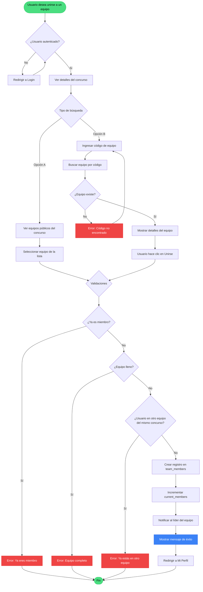
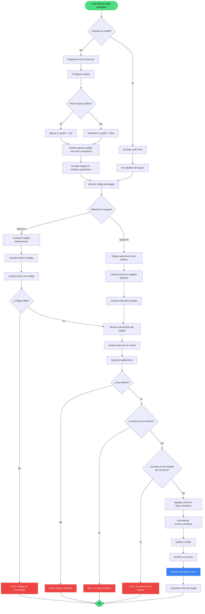
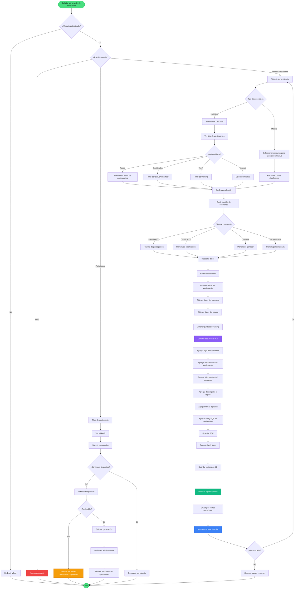

# 📊 Diagramas de Procesos - Sistema CodeBattle

Este documento contiene los diagramas de procesos para los principales flujos del sistema de gestión de concursos de programación CodeBattle.

## 📑 Índice
1. [Solicitud para unirse a un equipo](#1-solicitud-para-unirse-a-un-equipo)
2. [Invitación de líderes para integrar nuevos miembros](#2-invitación-de-líderes-para-integrar-nuevos-miembros)
3. [Evaluación de proyectos](#3-evaluación-de-proyectos)
4. [Generación de constancias](#4-generación-de-constancias)

---

## 1. Solicitud para unirse a un equipo

### Descripción
Este proceso permite a un usuario participante buscar y unirse a equipos públicos que tienen cupos disponibles en un concurso específico.

### Actores
- **Usuario Participante**: Usuario con rol "user" que desea unirse a un equipo
- **Sistema**: Plataforma CodeBattle
- **Líder de Equipo**: Usuario que creó el equipo

### Diagrama de Flujo



### Reglas de Negocio

1. **Autenticación**: El usuario debe estar autenticado en el sistema
2. **Un equipo por concurso**: Un usuario solo puede pertenecer a un equipo por concurso
3. **Capacidad del equipo**: El equipo no debe estar completo (current_members < max_members)
4. **Equipos públicos**: Solo se pueden buscar y unir a equipos marcados como públicos (is_public = true)
5. **Estado automático**: Al unirse, el estado del miembro se establece como "accepted" automáticamente
6. **Código único**: Cada equipo tiene un código alfanumérico de 5 caracteres único

### Tablas Involucradas

- **users**: Información del usuario participante
- **contests**: Información del concurso
- **contest_registrations**: Equipos registrados en el concurso
- **team_members**: Miembros de cada equipo

### Endpoints

- `GET /concursos/{contest}/equipos-publicos` - Ver equipos públicos
- `POST /equipos/buscar` - Buscar equipo por código
- `POST /equipos/{team}/unirse` - Unirse al equipo

---

## 2. Invitación de líderes para integrar nuevos miembros

### Descripción
Este proceso permite al líder de un equipo compartir el código del equipo para invitar a nuevos miembros. Los usuarios interesados pueden usar este código para solicitar unirse al equipo.

### Actores
- **Líder de Equipo**: Usuario que creó el equipo y tiene el rol de líder
- **Usuario Participante**: Usuario que desea unirse al equipo
- **Sistema**: Plataforma CodeBattle

### Diagrama de Flujo



### Reglas de Negocio

1. **Código único**: Cada equipo tiene un código alfanumérico único de 5 caracteres generado automáticamente
2. **Visibilidad del equipo**: 
   - Equipos públicos (is_public = true): Aparecen en búsquedas y listas públicas
   - Equipos privados (is_public = false): Solo accesibles mediante código
3. **Capacidad limitada**: El equipo tiene un número máximo de miembros (max_members)
4. **Líder del equipo**: El usuario que crea el registro es automáticamente el líder (team_leader_id = user_id)
5. **Un equipo por concurso**: Un usuario solo puede estar en un equipo por concurso
6. **Estado de aceptación**: Los miembros que se unen tienen estado "accepted" automáticamente

### Flujo de Datos

**Creación del Equipo:**
```
Líder → Sistema: Registrar en concurso
Sistema → BD: INSERT contest_registrations (team_code, team_leader_id, is_public)
Sistema → Líder: Mostrar código generado
```

**Invitación:**
```
Líder → Usuario: Compartir código (fuera del sistema)
Usuario → Sistema: Buscar código
Sistema → BD: SELECT team WHERE team_code = ?
Sistema → Usuario: Mostrar detalles del equipo
```

**Unión:**
```
Usuario → Sistema: Solicitar unirse
Sistema → BD: INSERT team_members
Sistema → BD: UPDATE contest_registrations SET current_members++
Sistema → Líder: Notificación
Sistema → Usuario: Confirmación
```

### Tablas Involucradas

- **contest_registrations**: 
  - team_code (código único)
  - team_leader_id (líder del equipo)
  - is_public (visibilidad)
  - max_members (capacidad)
  - current_members (contador)
  
- **team_members**: 
  - contest_registration_id
  - user_id
  - status (accepted/pending/rejected)

### Endpoints

- `POST /concursos/{id}/registrar` - Crear equipo
- `POST /equipos/buscar` - Buscar por código
- `GET /concursos/{contest}/equipos-publicos` - Listar equipos públicos
- `POST /equipos/{team}/unirse` - Unirse al equipo

---

## 3. Evaluación de proyectos

### Descripción
Este proceso permite a los administradores y jueces evaluar los proyectos presentados por los equipos en un concurso, asignando puntajes en diferentes categorías y determinando si el equipo clasifica.

### Actores
- **Administrador**: Usuario con rol "admin" o "super_admin" que puede gestionar concursos
- **Juez**: Usuario con rol "juez" que puede evaluar proyectos
- **Sistema**: Plataforma CodeBattle
- **Equipo**: Grupo de participantes siendo evaluados

### Diagrama de Flujo



```mermaid
flowchart TD
    Start([Iniciar evaluación de proyectos]) --> RoleCheck{¿Rol del usuario?}
    
    RoleCheck -->|Admin/Super Admin| AdminAccess[Acceso al panel de administración]
    RoleCheck -->|Juez| JudgeAccess[Acceso al panel de jueces]
    RoleCheck -->|Otro| AccessDenied[Acceso denegado]
    AccessDenied --> End([Fin])
    
    AdminAccess --> SelectContest[Seleccionar concurso a evaluar]
    JudgeAccess --> ViewAssigned[Ver concursos asignados]
    
    ViewAssigned --> SelectContest
    SelectContest --> ViewTeams[Ver lista de equipos registrados]
    
    ViewTeams --> FilterTeams{¿Aplicar filtros?}
    FilterTeams -->|Sí| ApplyFilters[Filtrar por estado/puntaje]
    ApplyFilters --> ShowFiltered[Mostrar equipos filtrados]
    FilterTeams -->|No| ShowAll[Mostrar todos los equipos]
    
    ShowFiltered --> SelectTeam[Seleccionar equipo a evaluar]
    ShowAll --> SelectTeam
    
    SelectTeam --> ViewProject[Ver detalles del proyecto del equipo]
    ViewProject --> EvaluationForm[Abrir formulario de evaluación]
    
    EvaluationForm --> EnterScores[Ingresar puntajes por categoría]
    
    EnterScores --> Functionality[Funcionalidad: 0-25 puntos]
    Functionality --> Design[Diseño: 0-25 puntos]
    Design --> CodeQuality[Calidad del código: 0-25 puntos]
    CodeQuality --> Innovation[Innovación: 0-25 puntos]
    
    Innovation --> ValidateScores{¿Puntajes válidos?}
    ValidateScores -->|No| ErrorRange[Error: Puntaje fuera de rango]
    ErrorRange --> EnterScores
    
    ValidateScores -->|Sí| CalculateTotal[Calcular puntaje total]
    CalculateTotal --> EnterFeedback[Ingresar comentarios/feedback]
    
    EnterFeedback --> SubmitEvaluation[Enviar evaluación]
    SubmitEvaluation --> SaveScores[Guardar puntajes en BD]
    
    SaveScores --> CheckQualification{¿Puntaje >= 50?}
    CheckQualification -->|Sí| SetQualified[Establecer status = 'qualified']
    CheckQualification -->|No| SetRegistered[Mantener status = 'registered']
    
    SetQualified --> UpdateLeaderboard[Actualizar tabla de clasificación]
    SetRegistered --> UpdateLeaderboard
    
    UpdateLeaderboard --> NotifyTeam[Notificar al equipo]
    NotifyTeam --> ShowSuccessMsg[Mostrar mensaje de éxito]
    
    ShowSuccessMsg --> MoreTeams{¿Evaluar más equipos?}
    MoreTeams -->|Sí| ViewTeams
    MoreTeams -->|No| GenerateReport[Generar reporte de evaluación]
    
    GenerateReport --> ExportResults[Exportar resultados]
    ExportResults --> End

    style Start fill:#4ade80,stroke:#22c55e,color:#000
    style End fill:#4ade80,stroke:#22c55e,color:#000
    style AccessDenied fill:#ef4444,stroke:#dc2626,color:#fff
    style ErrorRange fill:#ef4444,stroke:#dc2626,color:#fff
    style SetQualified fill:#10b981,stroke:#059669,color:#fff
    style ShowSuccessMsg fill:#3b82f6,stroke:#2563eb,color:#fff
```

### Criterios de Evaluación

El sistema evalúa los proyectos en 4 categorías principales, cada una con un máximo de 25 puntos:

1. **Funcionalidad (0-25 puntos)**
   - ¿El proyecto cumple con los requisitos solicitados?
   - ¿Las características funcionan correctamente?
   - ¿Hay bugs o errores críticos?

2. **Diseño (0-25 puntos)**
   - ¿La interfaz es intuitiva y fácil de usar?
   - ¿El diseño es atractivo y profesional?
   - ¿Hay consistencia visual?

3. **Calidad del Código (0-25 puntos)**
   - ¿El código está bien estructurado?
   - ¿Se siguen buenas prácticas?
   - ¿Hay documentación adecuada?

4. **Innovación (0-25 puntos)**
   - ¿El proyecto es original?
   - ¿Presenta soluciones creativas?
   - ¿Tiene características únicas o destacables?

**Puntaje Total**: Suma de las 4 categorías (0-100 puntos)

### Reglas de Negocio

1. **Clasificación automática**: 
   - Puntaje >= 50: El equipo clasifica automáticamente (status = "qualified")
   - Puntaje < 50: El equipo no clasifica (status = "registered")

2. **Permisos de evaluación**:
   - Administradores: Pueden evaluar cualquier equipo
   - Jueces: Solo pueden evaluar equipos de concursos asignados

3. **Reevaluación**: 
   - Se puede actualizar la evaluación de un equipo
   - El nuevo puntaje reemplaza al anterior

4. **Desglose de puntajes**:
   - Se guarda el detalle de cada categoría en formato JSON
   - Se permite agregar comentarios y feedback

5. **Tabla de clasificación**:
   - Solo equipos con score > 0 aparecen en la clasificación
   - Ordenamiento por puntaje descendente
   - En caso de empate, se ordena por fecha de envío

### Estructura de Datos

**Tabla contest_registrations:**
```sql
- score: INTEGER (0-100) - Puntaje total
- score_details: JSON - Desglose por categoría
  {
    "functionality": 23,
    "design": 20,
    "code_quality": 22,
    "innovation": 18
  }
- feedback: TEXT - Comentarios del evaluador
- status: ENUM - Estado (registered, qualified, disqualified)
```

### Flujo de Datos

```
Evaluador → Sistema: Seleccionar equipo
Sistema → BD: SELECT team WHERE id = ?
Sistema → Evaluador: Mostrar formulario

Evaluador → Sistema: Enviar puntajes
Sistema → Validación: Verificar rangos (0-25 por categoría)
Sistema → Cálculo: total = sum(categorías)
Sistema → BD: UPDATE contest_registrations SET score, score_details, feedback
Sistema → BD: UPDATE status = (score >= 50 ? 'qualified' : 'registered')
Sistema → BD: INSERT/UPDATE leaderboard
Sistema → Equipo: Notificación de evaluación
Sistema → Evaluador: Confirmación
```

### Endpoints

- `GET /admin/concursos/{id}/equipos` - Ver equipos del concurso
- `POST /admin/concursos/{contest}/equipos/{team}/calificar` - Evaluar equipo
- `POST /admin/concursos/{contest}/equipos/{team}/qualify` - Clasificar manualmente
- `POST /admin/concursos/{contest}/equipos/{team}/disqualify` - Descalificar
- `GET /clasificacion/{id}` - Ver tabla de clasificación

### Permisos Requeridos

- **super_admin**: Acceso completo
- **admin**: Puede evaluar y gestionar concursos
- **juez**: Puede evaluar solo concursos asignados
- **user**: Solo puede ver resultados públicos

---

## 4. Generación de constancias

### Descripción
Este proceso permite generar certificados o constancias de participación y reconocimiento para los equipos que participaron en un concurso, especialmente para aquellos que clasificaron o ganaron.

### Actores
- **Administrador**: Usuario con rol "admin" o "super_admin"
- **Sistema**: Plataforma CodeBattle
- **Participante**: Usuario que recibe la constancia

### Diagrama de Flujo



### Tipos de Constancias

1. **Constancia de Participación**
   - Para todos los participantes que completaron el concurso
   - Requisito: Haber enviado un proyecto
   - Incluye: Nombre del participante, nombre del concurso, fecha, equipo

2. **Constancia de Clasificación**
   - Para equipos que obtuvieron >= 50 puntos
   - Requisito: Status = "qualified"
   - Incluye: Puntaje obtenido, posición en ranking, categorías evaluadas

3. **Constancia de Ganador**
   - Para los 3 primeros lugares
   - Requisito: Ranking posición 1-3
   - Incluye: Posición específica, puntaje, reconocimientos especiales

4. **Constancia Personalizada**
   - Para reconocimientos especiales
   - Requisito: Aprobación del administrador
   - Incluye: Texto personalizado, logros específicos

### Reglas de Negocio

1. **Elegibilidad para constancias**:
   - Participación: Todos los equipos registrados
   - Clasificación: Score >= 50 y status = "qualified"
   - Ganador: Top 3 en ranking final
   - Personalizada: A criterio del administrador

2. **Generación automática vs. manual**:
   - Automática: Al finalizar el concurso para clasificados
   - Manual: Solicitada por participante o administrador
   - Masiva: Para todos los elegibles de un concurso

3. **Verificación de autenticidad**:
   - Cada constancia tiene un código QR único
   - El QR contiene un hash verificable
   - URL de verificación pública en el sistema

4. **Formato y contenido**:
   - Formato: PDF de alta calidad
   - Logo oficial de CodeBattle
   - Información del concurso y participante
   - Fecha de emisión
   - Firmas digitales del staff
   - Código QR de verificación

5. **Almacenamiento**:
   - PDFs guardados en storage/certificates/
   - Registro en base de datos
   - Enlace de descarga enviado por email

### Estructura de Datos (Propuesta)

**Tabla certificates (nueva tabla recomendada):**
```sql
CREATE TABLE certificates (
  id BIGINT PRIMARY KEY AUTO_INCREMENT,
  user_id BIGINT FOREIGN KEY REFERENCES users(id),
  contest_id BIGINT FOREIGN KEY REFERENCES contests(id),
  team_id BIGINT FOREIGN KEY REFERENCES contest_registrations(id),
  type ENUM('participation', 'qualification', 'winner', 'custom'),
  position INT NULL, -- Para ganadores (1, 2, 3)
  score INT NULL, -- Puntaje obtenido
  certificate_code VARCHAR(50) UNIQUE, -- Código único de verificación
  file_path VARCHAR(255), -- Ruta del PDF
  hash VARCHAR(255), -- Hash para verificación
  issued_by BIGINT FOREIGN KEY REFERENCES users(id), -- Admin que lo generó
  issued_at TIMESTAMP,
  is_valid BOOLEAN DEFAULT true, -- Para invalidar certificados si es necesario
  created_at TIMESTAMP,
  updated_at TIMESTAMP
)
```

### Contenido de la Constancia

**Sección Superior:**
- Logo de CodeBattle
- Título: "CONSTANCIA DE [TIPO]"
- Número de certificado único

**Sección Principal:**
```
Se otorga la presente constancia a:

[NOMBRE DEL PARTICIPANTE]

Por su [destacada/excelente/valiosa] participación en el concurso:

[NOMBRE DEL CONCURSO]
Realizado del [FECHA INICIO] al [FECHA FIN]

Como miembro del equipo: [NOMBRE DEL EQUIPO]
```

**Sección de Logros (si aplica):**
- Posición obtenida: [1°, 2°, 3° lugar o Top N]
- Puntaje: [XX/100 puntos]
- Destacado en: [Categorías donde sobresalió]

**Sección Inferior:**
- Fecha de emisión
- Firma digital del organizador
- Código QR con enlace de verificación
- URL de verificación: codebattle.com/verificar/[CODE]

### Flujo de Datos

**Generación Individual:**
```
Admin → Sistema: Seleccionar participante
Sistema → BD: SELECT user, team, contest, score
Sistema → Generator: Crear PDF con plantilla
Generator → Storage: Guardar en /certificates/
Sistema → BD: INSERT certificate record
Sistema → Email: Enviar a participante
Sistema → Admin: Confirmación
```

**Generación Masiva:**
```
Admin → Sistema: Seleccionar concurso + filtros
Sistema → BD: SELECT all eligible participants
Sistema → Queue: Agregar trabajos a cola
Queue → Generator: Procesar cada certificado
Generator → Storage: Guardar PDFs
Sistema → BD: INSERT batch records
Sistema → Email: Enviar notificaciones masivas
Sistema → Admin: Reporte de generación
```

**Verificación:**
```
Público → Sistema: Escanear QR o ingresar código
Sistema → BD: SELECT certificate WHERE code = ?
Sistema → Validación: Verificar hash
Sistema → Público: Mostrar información del certificado
```

### Endpoints (Propuestos)

**Administración:**
- `GET /admin/constancias` - Panel de gestión
- `GET /admin/concursos/{contest}/constancias` - Constancias del concurso
- `POST /admin/constancias/generar` - Generar individual
- `POST /admin/constancias/generar-masivo` - Generar masivo
- `DELETE /admin/constancias/{id}` - Invalidar constancia

**Participante:**
- `GET /mi-perfil/constancias` - Ver mis constancias
- `GET /constancias/{id}/descargar` - Descargar PDF
- `POST /constancias/solicitar` - Solicitar constancia

**Público:**
- `GET /verificar/{code}` - Verificar autenticidad
- `GET /constancia/preview/{code}` - Vista previa pública

### Librerías Recomendadas

Para implementar la generación de constancias en Laravel:

1. **barryvdh/laravel-dompdf** - Generación de PDFs
   ```bash
   composer require barryvdh/laravel-dompdf
   ```

2. **SimpleSoftwareIO/simple-qrcode** - Generación de códigos QR
   ```bash
   composer require simplesoftwareio/simple-qrcode
   ```

3. **Laravel Queues** - Para procesamiento asíncrono de generación masiva
   - Ya incluido en Laravel

### Implementación Sugerida

**1. Crear modelo y migración:**
```bash
php artisan make:model Certificate -m
php artisan make:controller CertificateController
```

**2. Configurar rutas:**
```php
Route::middleware(['auth', 'admin'])->group(function () {
    Route::get('/admin/constancias', [CertificateController::class, 'index']);
    Route::post('/admin/constancias/generar', [CertificateController::class, 'generate']);
    Route::post('/admin/constancias/masivo', [CertificateController::class, 'bulkGenerate']);
});
```

**3. Crear plantilla Blade:**
```blade
<!-- resources/views/certificates/template.blade.php -->
<div class="certificate">
    
    <h1>CONSTANCIA DE {{ strtoupper($type) }}</h1>
    <!-- Contenido del certificado -->
    <div class="qr-code">
        {!! QrCode::size(150)->generate($verificationUrl) !!}
    </div>
</div>
```

**4. Implementar lógica de generación:**
```php
public function generate(Request $request)
{
    // Validar y recopilar datos
    $data = $this->gatherCertificateData($request);
    
    // Generar PDF
    $pdf = PDF::loadView('certificates.template', $data);
    
    // Guardar en storage
    $filename = "certificate_{$user->id}_{$contest->id}_" . time() . ".pdf";
    $path = "certificates/{$contest->id}";
    Storage::put("$path/$filename", $pdf->output());
    
    // Crear registro
    Certificate::create([...]);
    
    // Enviar email
    Mail::to($user)->send(new CertificateGenerated($certificate));
    
    return back()->with('success', 'Constancia generada');
}
```

---

## 📝 Notas de Implementación

### Estado Actual del Sistema

Los diagramas presentados reflejan la funcionalidad parcialmente implementada en el sistema CodeBattle:

✅ **Completamente Implementado:**
- Proceso 1: Solicitud para unirse a un equipo
- Proceso 2: Invitación de líderes (parcial)
- Proceso 3: Evaluación de proyectos (estructura básica)

⚠️ **Pendiente de Implementación:**
- Proceso 2: Sistema de notificaciones para invitaciones
- Proceso 3: Interfaz completa de evaluación de jueces
- Proceso 4: Generación de constancias (completamente nuevo)

### Recomendaciones para Desarrollo

1. **Prioridad Alta:**
   - Implementar tabla `certificates` y modelo relacionado
   - Crear controlador `CertificateController`
   - Diseñar plantillas de constancias en Blade
   - Integrar librerías de PDF y QR

2. **Prioridad Media:**
   - Sistema de notificaciones para equipos
   - Panel de evaluación para jueces
   - Dashboard de estadísticas de certificados

3. **Prioridad Baja:**
   - Personalización avanzada de plantillas
   - Sistema de verificación pública de constancias
   - Exportación de reportes de certificados

### Consideraciones de Seguridad

- **Verificación de Certificados**: Implementar hash SHA-256 para validación
- **Acceso Restringido**: Solo administradores pueden generar constancias
- **Auditoría**: Registrar quién genera cada certificado y cuándo
- **Prevención de Fraude**: Códigos únicos no predecibles
- **Almacenamiento Seguro**: PDFs en storage privado, acceso mediante controlador

### Mejoras Futuras

1. **Automatización**: Generación automática al finalizar concurso
2. **Plantillas Dinámicas**: Editor visual de plantillas
3. **Firma Digital**: Integración con servicios de firma electrónica
4. **Blockchain**: Registro de certificados en blockchain para verificación permanente
5. **API Pública**: Endpoint para verificación externa de certificados

---

## 📚 Referencias

- **Laravel Documentation**: https://laravel.com/docs
- **Mermaid Diagrams**: https://mermaid.js.org/
- **BPMN 2.0**: Business Process Model and Notation
- **Spatie Permission**: https://spatie.be/docs/laravel-permission
- **DomPDF**: https://github.com/barryvdh/laravel-dompdf
- **QR Code Generator**: https://www.simplesoftware.io/docs/simple-qrcode

---

## ✅ Validación de Diagramas

Estos diagramas han sido creados basándose en:
- ✅ Análisis del código fuente existente
- ✅ Modelos de base de datos (User, Contest, ContestRegistration, TeamMember, Judge)
- ✅ Controladores implementados (TeamController, AdminContestController, JudgeController)
- ✅ Rutas definidas en `routes/web.php`
- ✅ Middlewares de autorización (super_admin, admin)
- ✅ Sistema de roles de Spatie Permission

**Fecha de Creación**: Diciembre 2025
**Versión del Sistema**: CodeBattle v1.0
**Autor**: Documentación Técnica CodeBattle
