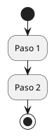

# 📊 Diagramas PlantUML - CodeBattle

Esta carpeta contiene los diagramas de procesos del sistema CodeBattle en formato **PlantUML**.

## 🎯 Archivos Disponibles

| Archivo | Descripción |
|---------|-------------|
| `1_solicitud_unirse_equipo.puml` | Proceso de solicitud para unirse a un equipo |
| `2_invitacion_lideres.puml` | Proceso de invitación de líderes para integrar miembros |
| `3_evaluacion_proyectos.puml` | Proceso de evaluación de proyectos por jueces |
| `4_generacion_constancias.puml` | Proceso de generación de constancias/certificados |

## 🔍 Cómo Visualizar los Diagramas

### Opción 1: PlantText (Recomendado)
1. Ir a https://www.planttext.com/
2. Copiar el contenido del archivo `.puml`
3. Pegar en el editor
4. Ver el diagrama generado automáticamente
5. Descargar como PNG o SVG

### Opción 2: PlantUML Online Editor
1. Ir a http://www.plantuml.com/plantuml/
2. Pegar el código en el editor
3. Generar diagrama

### Opción 3: Visual Studio Code
1. Instalar extensión "PlantUML"
2. Abrir archivo `.puml`
3. Presionar `Alt + D` para previsualizar

### Opción 4: IntelliJ IDEA / PyCharm
1. Instalar plugin "PlantUML integration"
2. Abrir archivo `.puml`
3. Ver preview automático

## 📥 Generar Imágenes

### Usando CLI (requiere Java y Graphviz):

```bash
# Instalar PlantUML CLI
brew install plantuml  # macOS
sudo apt install plantuml  # Linux

# Generar PNG
plantuml diagramas/1_solicitud_unirse_equipo.puml

# Generar SVG
plantuml -tsvg diagramas/*.puml

# Generar todos
plantuml diagramas/*.puml
```

### Usando Docker:

```bash
# Generar todos los diagramas como PNG
docker run --rm -v $(pwd):/data plantuml/plantuml \
  -tpng /data/diagramas/*.puml

# Generar como SVG
docker run --rm -v $(pwd):/data plantuml/plantuml \
  -tsvg /data/diagramas/*.puml
```

## 🎨 Colores Utilizados

Los diagramas usan un esquema de colores consistente:

| Color | Uso | Código |
|-------|-----|--------|
| Azul (`#E3F2FD`) | Proceso 1 - Unirse a equipo | `#1976D2` |
| Naranja (`#FFF3E0`) | Proceso 2 - Invitaciones | `#F57C00` |
| Morado (`#E1BEE7`) | Proceso 3 - Evaluación | `#7B1FA2` |
| Lavanda (`#F3E5F5`) | Proceso 4 - Constancias | `#8E24AA` |
| Verde (`#C8E6C9`) | Estados de éxito | `#388E3C` |
| Rojo (`#FFCDD2`) | Estados de error | `#C62828` |

## 📖 Documentación Completa

Para ver la documentación detallada con descripciones, reglas de negocio y ejemplos de código, consulta:

**`DIAGRAMAS_PROCESOS.md`** en la raíz del proyecto.

## 🔗 Enlaces Útiles

- [PlantUML Cheat Sheet](https://plantuml.com/en/activity-diagram-beta)
- [PlantText Editor](https://www.planttext.com/)
- [PlantUML Documentation](https://plantuml.com/)
- [Activity Diagram Syntax](https://plantuml.com/en/activity-diagram-beta)

## ✨ Ejemplo de Uso



---

**Proyecto**: CodeBattle  
**Formato**: PlantUML (`.puml`)  
**Fecha**: Diciembre 2025
